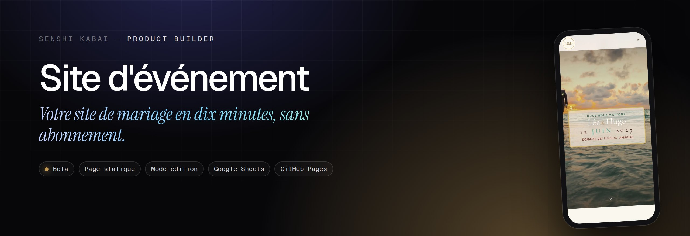
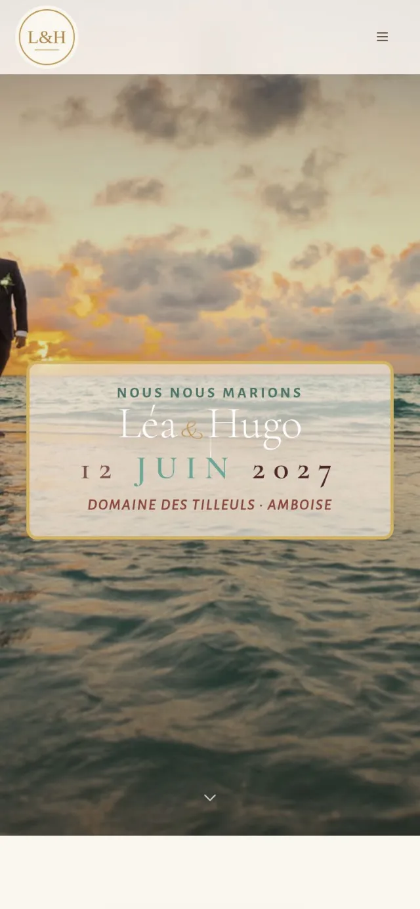
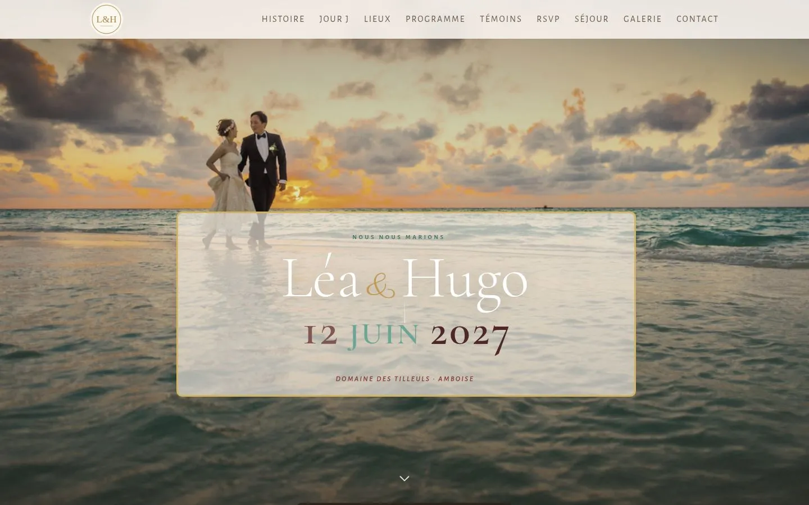
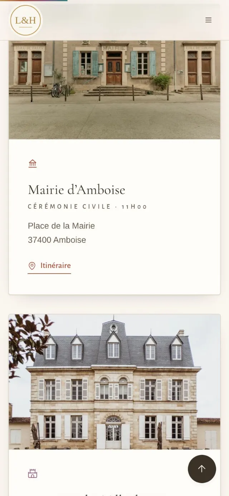
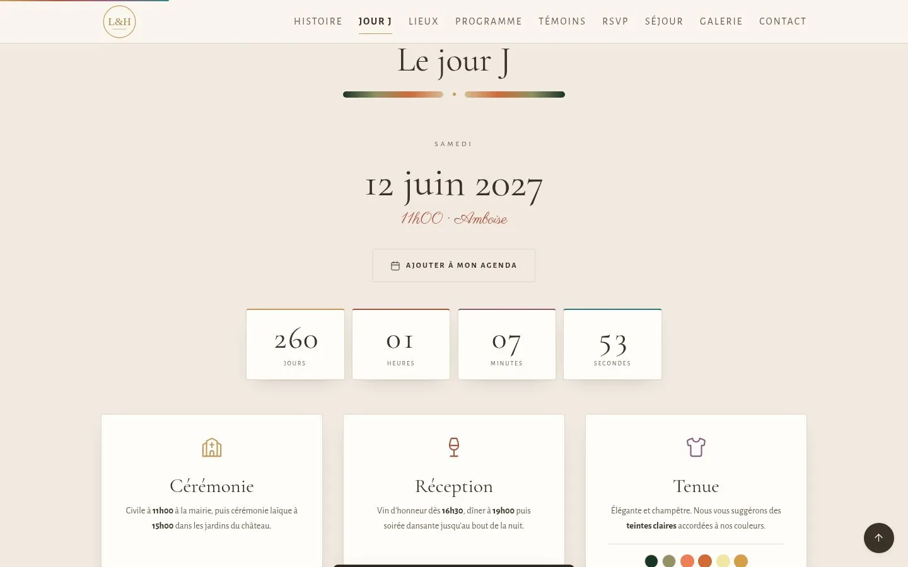

  
  

<h1 align="center">Site d'événement</h1>

<b>Votre site de mariage en dix minutes, sans abonnement.</b> Un site d'événement élégant et complet : programme, lieux, RSVP, séjour, galerie, écran d'accès pour les invités. Tout se modifie directement dans la page.

Statut : <b>Bêta</b>

> **Pensé pour le téléphone.** C'est une application web installable (PWA) : ouvrez la démo sur votre mobile pour la voir telle qu'elle a été conçue. Sur un ordinateur, l'affichage n'est pas celui prévu ; la [fiche du portfolio](https://www.senshicore.com/projets/site-evenement/) l'ouvre dans un cadre de téléphone, avec un QR code pour passer sur mobile.

---

### Le problème

Les sites de mariage clés en main sont chers, pleins de publicité ou tous identiques. Et les réponses des invités finissent éparpillées entre SMS, emails et appels.

### L'idée

Une seule page, belle sur mobile, que les organisateurs personnalisent eux-mêmes sans code, avec un vrai suivi des réponses.

### Comment c'est fait

Page statique avec mode édition intégré : textes, photos, thème et sections se modifient sur place, puis se publient sur GitHub Pages. Les RSVP partent dans un Google Sheet via un petit script, avec un tableau de bord des réponses et un export CSV. Né d'un projet personnel, rendu générique.

**Outils** &nbsp; `Page statique` `Mode édition` `Google Sheets` `GitHub Pages`

### Aperçu

   

### Mentions

Toutes les personnes, lieux et dates de la démo sont fictifs.

### English

**Site d'événement** — *Your wedding website in ten minutes, no subscription.* An elegant, complete event website: schedule, venues, RSVP, stay, gallery, a guest access screen. Everything is edited right on the page.

Off-the-shelf wedding sites are expensive, full of ads or all look alike. And guests' replies end up scattered across texts, emails and calls. A single page, beautiful on mobile, that hosts customise themselves without code, with proper tracking of replies. A static page with a built-in edit mode: texts, photos, theme and sections are edited in place, then published to GitHub Pages. RSVPs go to a Google Sheet through a small script, with a replies dashboard and CSV export. Born from a personal project, made generic.

---

Conçu, développé et mis en ligne par <b>Senshi Kabai</b>, Product Builder · <a href="https://www.senshicore.com/">portfolio</a> · <a href="https://www.senshicore.com/projets/site-evenement/">fiche du projet</a> © 2026 Senshi Kabai — tous droits réservés.

<b>Documentation technique</b> · notes de développement et de mise en ligne

## Site d'événement — clé en main

Un site de mariage (ou d'anniversaire, de baptême, de fête de famille) en une seule page,
élégant sur mobile comme sur ordinateur, **sans abonnement ni serveur**.

**Démo : https://engob.github.io/site-evenement/** — mot de passe invités : `demo`
(couple, lieux et témoins fictifs).

### Ce que ça fait

- **Écran d'accès** protégé par un mot de passe à donner aux invités, avec indice.
- **Notre histoire, le jour J** (compte à rebours, ajout à l'agenda Google / Outlook / Apple),
  **lieux** avec itinéraires, **programme** heure par heure, **témoins**.
- **RSVP** : présence, adultes / enfants, chanson préférée, allergies. Les réponses arrivent
  dans un Google Sheet (et par email) via un petit script Google Apps Script — sinon elles
  restent sur l'appareil de l'invité.
- **Tableau de bord des réponses** : qui vient, qui n'a pas répondu, export CSV.
- **Séjour** : où dormir, que faire dans la région, triés par budget.
- **Galerie**, **contact**, thème (couleurs, polices) personnalisable.
- **Mode édition** (`?edit=1`) : on modifie tous les textes, photos et sections directement
  dans la page, puis **Publier** envoie les changements sur GitHub Pages.

### Le personnaliser

1. Ouvrez la page avec `?edit=1` à la fin de l'adresse.
2. **Réglages** : prénoms, monogramme, date, lieu, date limite des réponses, mot de passe.
3. Cliquez sur n'importe quel texte ou photo pour le changer. **Thème** pour les couleurs.
4. **Publier** (jeton GitHub fine-grained limité au dépôt, permission *Contents : Read and write*),
   ou **Télécharger** le fichier et remplacez `index.html`.

Toute la configuration vit dans le bloc `<script id="site-config">` en haut de `index.html`.

### Confidentialité

Aucun compte, aucun traceur. Le jeton GitHub reste dans le navigateur de l'organisateur et
n'est jamais inclus dans le site publié. Les réponses des invités ne vont que dans le Google
Sheet des organisateurs.

---

Conçu et développé par [Senshi Kabai](https://www.senshicore.com/) — tous droits réservés.

